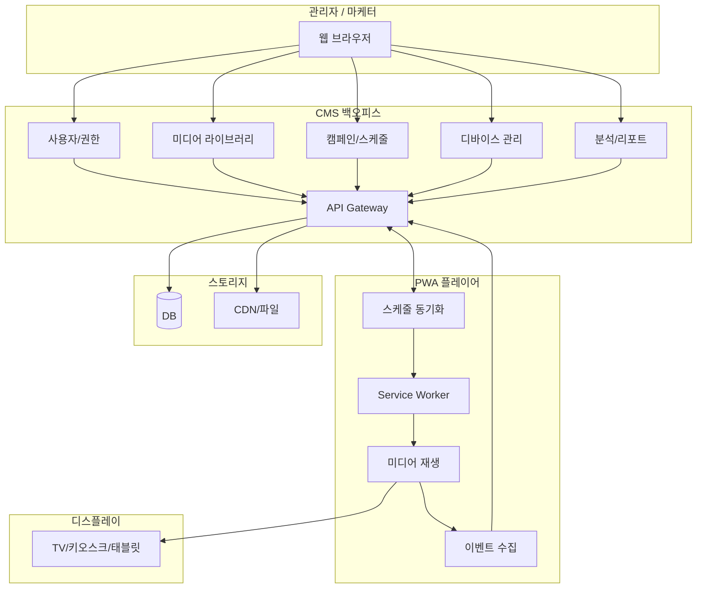
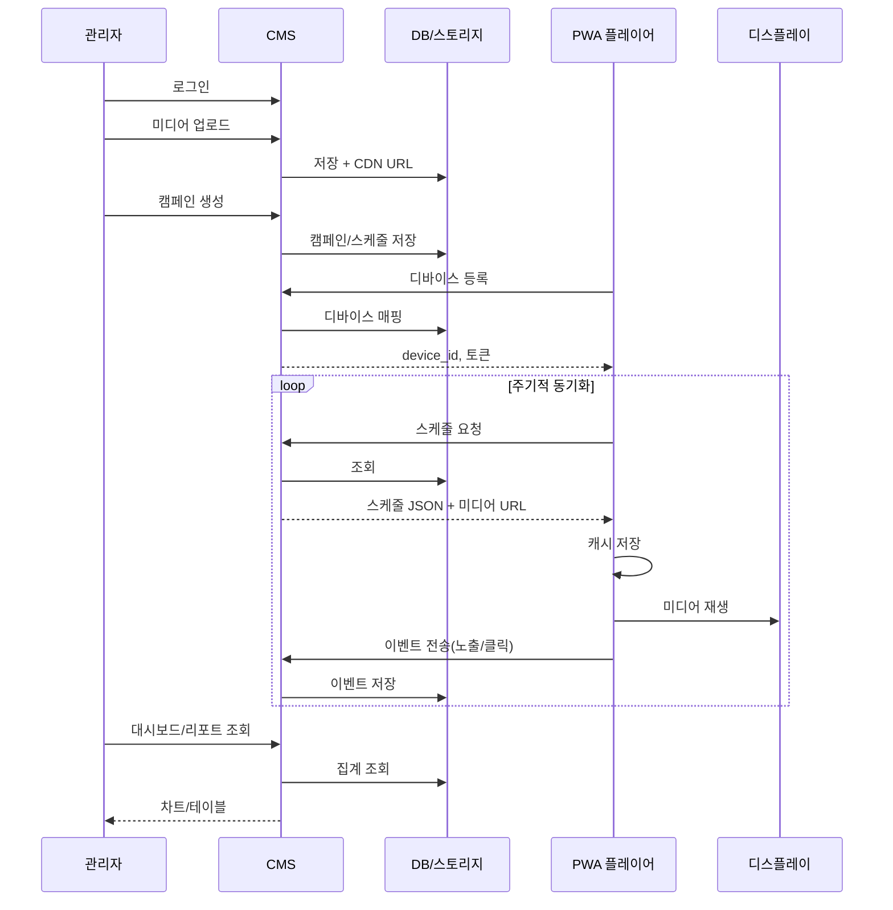
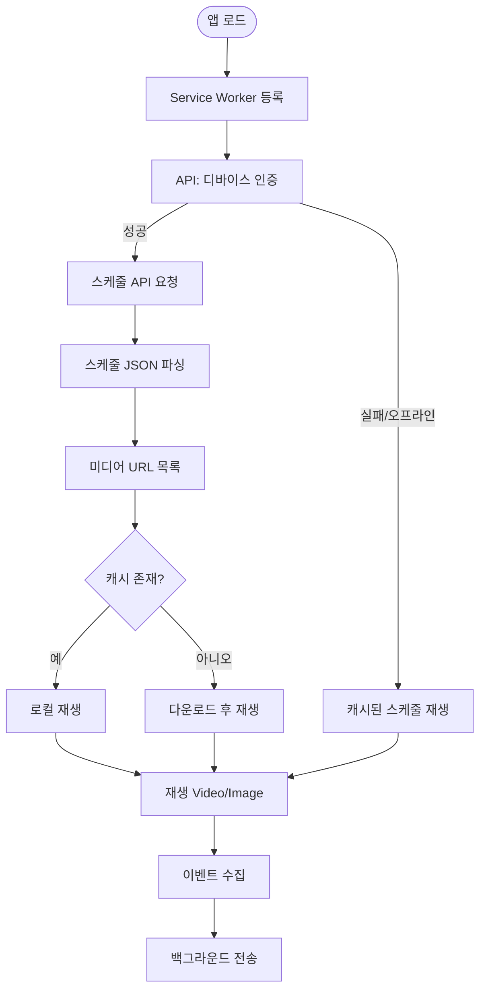
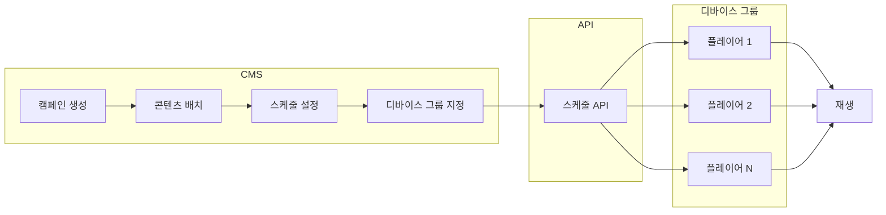
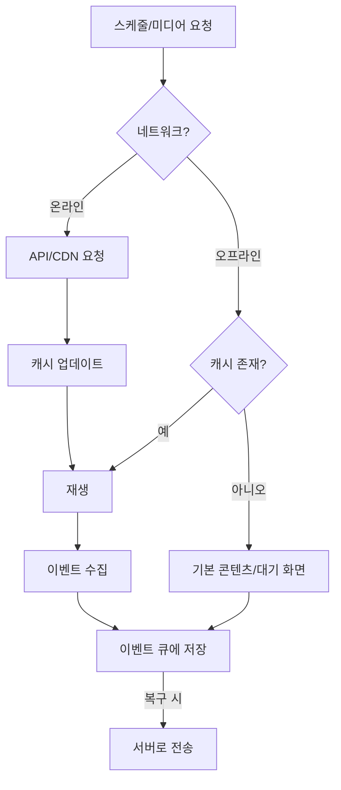

# PWA 디지털 광고 솔루션 - 시스템 흐름도 (Mermaid)

## 전체 시스템 아키텍처

## 데이터 흐름 시퀀스

## PWA 플레이어 내부 흐름

## 캠페인 → 디바이스 배포 흐름

## 오프라인 동작 흐름

---

위 다이어그램은 Mermaid를 지원하는 뷰어(GitHub, GitLab, Notion, VS Code 확장 등)에서 렌더링됩니다.
